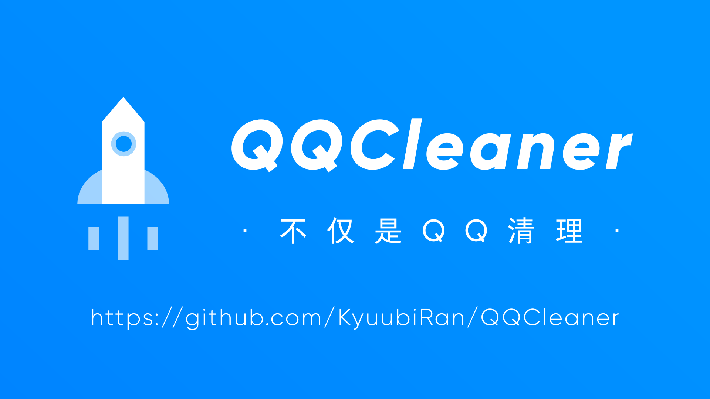
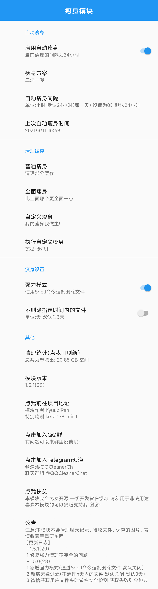

# 瘦身模块(QQCleaner)

---

已支持QQ、TIM、微信瘦身(1.4.0+) 大家觉得好用的话请给我点个小星星吧！   
欢迎大家提交pr和issues扩充瘦身模块的清理范围    

反馈QQ群:827356240 [Telegram频道](https://t.me/QQCleaner)   

本模块不会删除消息记录以及接收的文件 只会清理堆积在那里的图片、视频、广告等缓存    
注:本模块完全免费且开源，一切开发旨在学习，请勿用于非法用途。   

## 使用方法

1.勾上模块     
2.重启QQ/TIM/微信   
3.设置->关于->QQ/TIM/微信瘦身
 
## 功能
1.普通瘦身(日常聊天产生的垃圾清理)   
2.完全瘦身(尽可能的清理缓存 最大限度腾出空间)   
3.自定义瘦身(手动选择清理部分缓存)   
4.定时瘦身(自动执行瘦身操作)  
  
### TODO List
- [x] 自定义瘦身   
- [x] 定时瘦身    
- [x] 有个好康一点的UI   
- [x] 自定义瘦身间隔   
- [x] 适配TIM   
- [x] 适配微信瘦身    
